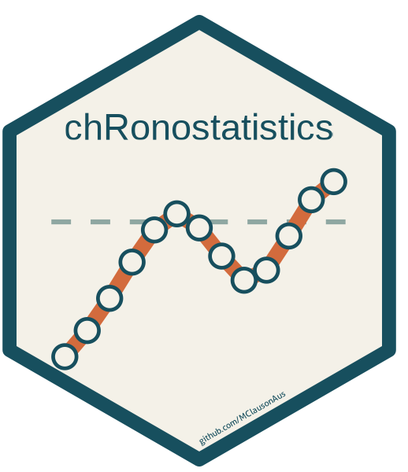
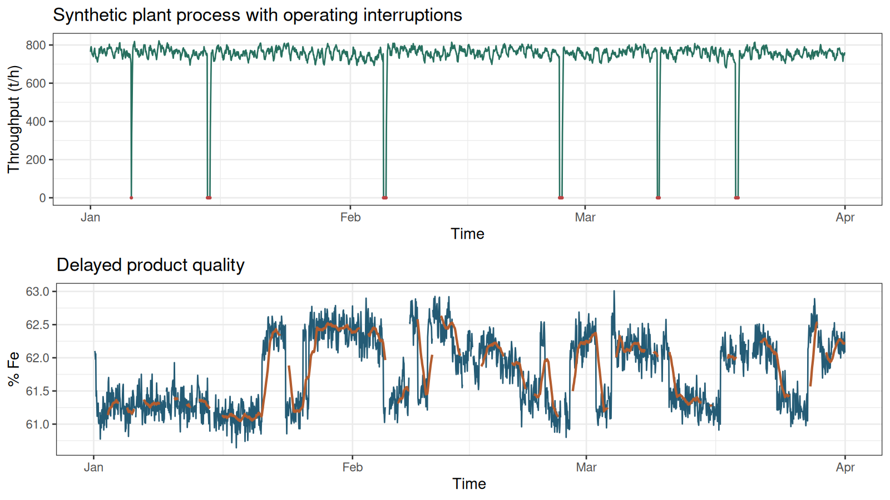
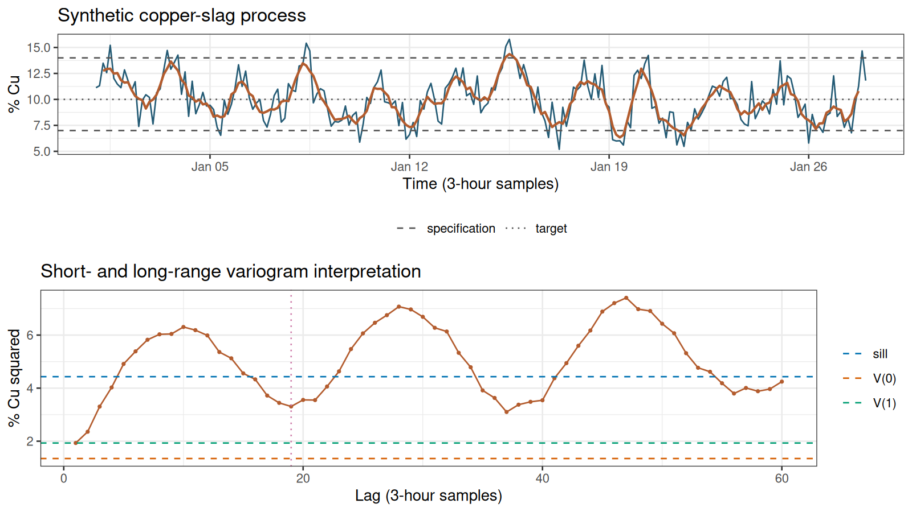
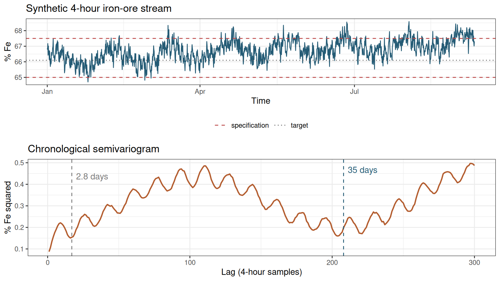
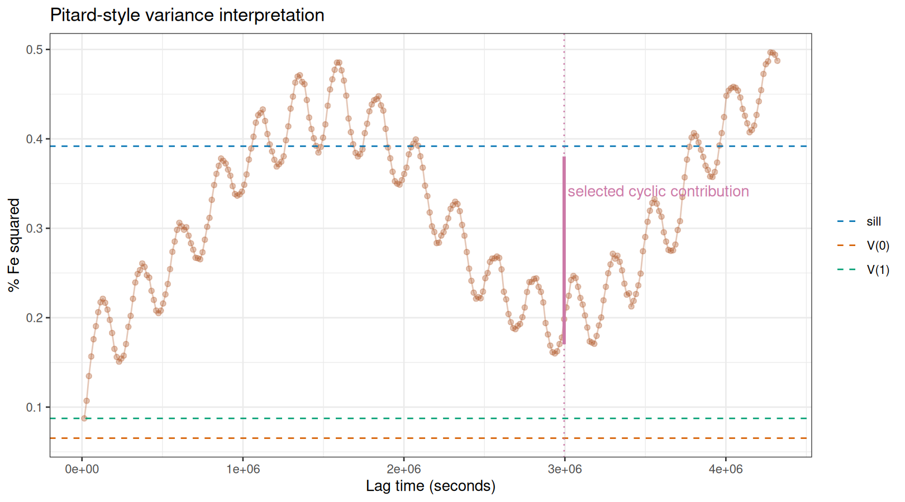

# chRonostatistics 

<!-- badges: start -->
[](https://github.com/ClausonGeomet/chRonostatistics-r/actions/workflows/R-CMD-check.yaml)
[](https://github.com/ClausonGeomet/chRonostatistics-r/releases/latest)
[](LICENSE.md)
<!-- badges: end -->

`chRonostatistics` is an R package for analysing variation in ordered process
data. It uses chronological semivariograms to separate variation occurring
over short, intermediate and repeating time scales.

The package is aimed at mineral-processing and process-engineering
applications where the order and spacing of observations contain useful
information. It provides direct and integral variograms, an engineering
variance decomposition, progressive operating limits, plotting methods and
reproducible process simulators.

## Installation

The current release is **v1.0.0**. Install it directly from GitHub:

```r
install.packages("remotes")
remotes::install_github("ClausonGeomet/chRonostatistics-r@v1.0.0")
```

If you want the latest development version from `main`, omit the version tag.

Then load the package:

```r
library(chRonostatistics)
```

## Main workflow

A practical analysis follows the data rather than starting with a model:

1. simulate or import the observations and perform a basic EDA check;
2. validate the time index and continuous segments with `chrono_data()`;
3. calculate and inspect the chronological semivariogram with
   `chrono_variogram()` and `ggplot2::autoplot()`;
4. return to the complete time series and compare the variogram structure with
   operating events, drift and specifications;
5. estimate sampling, interval-process and cyclic contributions with
   `chrono_components()` and explain them with `report()`; and
6. construct descriptive engineering limits with `chrono_control_limits()`.

These defaults follow the practical conventions in Part X: variograms use at
least 20 pairs by default, examples use 30, requested lags are capped at half
the series, the Pitard endpoint correction is the default for $V(0)$, and
cycle peaks/minima remain analyst-selected rather than automatically declared.

## Quick example

The example below simulates an hourly process with autocorrelation, measurement
error and a 24-observation operating cycle.

```r
library(chRonostatistics)

simulated <- simulate_chronostatistics(
  n = 24 * 28,
  interval = 3600,
  mean = 5.5,
  trend = 0.0008,
  ar = 0.55,
  cycle_period = 24,
  cycle_amplitude = 0.012,
  events = FALSE,
  seed = 20260721
)

# 1. Initial EDA: inspect size, finite values and the simulated scale.
summary(simulated)
mean(is.finite(simulated$value))

series <- chrono_data(
  simulated,
  time = time,
  value = value,
  interval = 3600,
  units = "grade",
  target = 5.5
)

# 2. Validation has now made the time spacing and segments explicit.
summary(series)

variogram <- chrono_variogram(
  series,
  max_lag = 72,
  min_pairs = 30
)

# 3. Inspect the variogram before selecting components.
ggplot2::autoplot(variogram)

integrals <- chrono_integral_variogram(
  variogram,
  integration = "trapezoid"
)

components <- chrono_components(
  variogram,
  cycle_lag = 24
)

# 4. Return to the complete time series and check the interpretation.
ggplot2::autoplot(series)
report(components)
variance_breakdown(components)

limits <- chrono_control_limits(components)

components
limits

plot(components)
plot(limits)
```

## Functions

| Function | Purpose |
|---|---|
| `chrono_data()` | Validates timestamps, regular spacing, missing values and data segments |
| `chrono_variogram()` | Calculates absolute or relative chronological semivariance by lag |
| `chrono_integral_variogram()` | Calculates first- and second-order integral variograms |
| `chrono_components()` | Estimates $V(0)$, $V(1)$, interval-process variance, cycle contribution and sill |
| `variance_breakdown()` | Returns a tidy table of component estimates, standard deviations and sill shares |
| `report()` | Explains a `chrono_components` result in a readable report-style summary |
| `chrono_control_limits()` | Constructs progressive descriptive engineering limits |
| `simulate_chronostatistics()` | Simulates a focused series with known trend, cycles, AR(1) variation, events and measurement error |
| `simulate_plant_process()` | Simulates a larger mineral-processing dataset with operating and laboratory variables |

The package supplies `plot()`, `summary()` and `print()` methods for its main
result classes. Equivalent `ggplot2::autoplot()` methods are also available.

## Plant-process examples

The larger simulator is designed for workflow development rather than for
reconstructing a particular mine. It includes ore-domain changes, short
operating cycles, autocorrelation, residence-time delays, maintenance,
downtime, sensor error and sparse laboratory results.



```r
plant <- simulate_plant_process(n = 24 * 90, seed = 20260717)

# Initial EDA before selecting a variable.
summary(plant)

# Use the regularly sampled online product analyser first.
product <- chrono_data(
  plant,
  time = timestamp,
  value = product_fe,
  interval = 3600,
  units = "% Fe"
)
summary(product)

product_variogram <- chrono_variogram(
  product,
  max_lag = 24 * 14,
  min_pairs = 30
)
ggplot2::autoplot(product_variogram)

# Return to the complete series after seeing the lag structure.
ggplot2::autoplot(product)
```

The laboratory result is intentionally sparse and delayed, so it should not
be treated as an hourly regular series without first creating an explicit
sampling grid. This distinction is important in real plant data: a delayed
laboratory table and an online analyser answer different process questions.

## A synthetic copper-slag case study

Part X illustrates a copper-slag stream sampled every three hours, with a
target of 10% Cu and specifications of 7% and 14% Cu. The following is a new
simulation at the same scale; it is not the book's data. It includes a modest
short-range measurement component and a 19-sample (57-hour) cycle.



```r
copper <- simulate_chronostatistics(
  n = 217, interval = 3 * 3600, mean = 10, trend = 0,
  ar = 0.6, innovation_sd = 1.2,
  cycle_period = 19, cycle_amplitude = 1.7,
  measurement_sd = 1.1, events = FALSE, seed = 351
)

# EDA and data-quality objectives.
summary(copper)
copper_data <- chrono_data(
  copper, time, value, interval = 3 * 3600, units = "% Cu",
  target = 10, lower_spec = 7, upper_spec = 14
)

# Short/long-range variogram; 30 pairs is used as a practical minimum.
copper_variogram <- chrono_variogram(
  copper_data, max_lag = 60, min_pairs = 30
)
ggplot2::autoplot(copper_variogram)

# The peak and cycle minimum are analyst-selected, as in Part X.
copper_components <- chrono_components(
  copper_variogram, cycle_lag = 19, cycle_peak_lag = 13
)
report(copper_components)
ggplot2::autoplot(copper_variogram, components = copper_components)

# Return to the complete chronological record.
ggplot2::autoplot(copper_data)
```

The `cycle_peak_lag` argument makes the graphical choice explicit. The
Pitard-style cycle contribution uses the selected peak/tangent and $V(0)$
to estimate a half-amplitude; it should not be treated as an automatic peak
detector.

## A paper-scale iron-ore example

The background paper by Minnitt and Pitard analyses 4-hourly iron-ore assays
and discusses a short cycle of roughly 17 lags and a larger cycle of roughly
208 lags. The following example uses those scales but generates new data; it
does not copy the paper's observations or figures.



```r
iron <- simulate_chronostatistics(
  n = 1511,
  interval = 4 * 3600,
  mean = 66.1,
  ar = 0.75,
  innovation_sd = 0.18,
  cycle_period = c(17, 208),
  cycle_amplitude = c(0.28, 0.50),
  measurement_sd = 0.25,
  events = FALSE,
  seed = 2008
)

summary(iron)

iron_data <- chrono_data(
  iron, time, value,
  interval = 4 * 3600,
  units = "% Fe", target = 66.1,
  lower_spec = 65, upper_spec = 67.5
)
summary(iron_data)

iron_variogram <- chrono_variogram(
  iron_data, max_lag = 300, min_pairs = 30
)
ggplot2::autoplot(iron_variogram)
iron_components <- chrono_components(
  iron_variogram, cycle_lag = 208
)
iron_limits <- chrono_control_limits(iron_components, center = "target")

iron_components[, c("V0", "V1", "cycle_contribution", "sill")]
iron_limits

# Pitard-style variogram annotation:
# V(0), V(1), sill and the selected cyclic contribution are shown together.
ggplot2::autoplot(
  iron_variogram,
  components = iron_components
)

# Check the complete process record against the interpretation.
ggplot2::autoplot(iron_data)

report(iron_components)
variance_breakdown(iron_components)
```



This workflow separates the questions that are often mixed together in a
standard control chart: how much variation is present at the sampling/analysis
scale, how much develops between adjacent samples, and how much is associated
with a selected repeating structure. The output remains descriptive; cycle
selection should be supported by plant knowledge and moving-average plots.

## Understanding the decomposition

`chrono_components()` reports several related quantities:

- **$V(0)$** estimates sampling, preparation and measurement variance by
  extrapolating the short-range integral variogram to zero lag.
- **$V(1)$** contains $V(0)$ plus process movement during one sampling
  interval.
- **$V(1)-V(0)$** is the estimated process contribution within one sampling
  interval.
- **Cycle contribution** follows the Pitard-style half amplitude between a
  selected peak/tangent and a minimum tangent anchored at $V(0)$. The
  `cycle_method = "peak_to_trough"` option is available when the full
  observed difference is required for comparison.
- **Sill** is a descriptive long-range variance benchmark.
- **Trend** describes the direction of the fitted local integral and is not an
  additional variance component.

Cycle selection is deliberately manual. Operating knowledge should be used
alongside the chronological plot and long-range variogram to distinguish real
cycles from aliasing, changing process states and isolated events.

For a report-style explanation, use `report()` on the component result. It
prints the selected method, key findings, caveats and a tidy breakdown table.
`variance_breakdown()` returns that table directly for further formatting with
`knitr::kable()`, `gt`, `flextable` or ordinary tidyverse workflows:

```r
component_report <- report(iron_components)
component_report$variance_table

variance_breakdown(iron_components)
```

### How the integral extrapolates $V(0)$

There is no observed lag-zero pair: subtracting an observation from itself
always gives zero. The first integral averages the semivariogram over the
interval from zero to lag $j$:

$$
W(j) = \frac{1}{j}\int_0^j V(u)\,du.
$$

For the Part X convention, the working curve is written as
$W(j) = W_0(j) + V(0)/(2j)$, where $j$ is the discrete lag index and $t_j$
is its elapsed lag time. The package fits the corrected short-lag curve
against $t_j$ and solves this endpoint relation for the unknown $V(0)$. In
other words, it uses the trend of several smoothed short-lag ordinates to
estimate the vertical-axis intercept; it does not treat the integral as
additional data. The integral reduces sensitivity to one noisy variogram
ordinate.

## Input requirements

Chronological lag calculations require observations that are:

- ordered in time;
- uniquely timestamped;
- regularly spaced within each continuous segment; and
- numeric and finite, apart from explicitly missing observations.

`chrono_data()` sorts an unordered series with a warning. Missing observations
and sufficiently large time gaps begin new segments. Smaller irregular
departures are rejected because an index lag would otherwise combine unequal
elapsed times. Irregular source data should be regularised before analysis.
The `units` argument describes measured values only. Numeric time can be
labelled separately with `time_units`; `POSIXct`/`POSIXlt` time is reported in
seconds and `Date` time in days.

## Tidy temporal data

Tidyverse users can pass a tibble directly using the same bare-column syntax as
the rest of the package:

```r
library(dplyr)

plant <- simulate_plant_process(n = 24 * 90, seed = 20260717)
plant_tbl <- plant |>
  transmute(timestamp, product_fe, availability)

product <- chrono_data(
  plant_tbl,
  time = timestamp,
  value = product_fe,
  interval = 3600,
  units = "% Fe"
)
```

The core package does not require the tidyverts ecosystem, but it also accepts
a `tsibble` directly when the optional `tsibble` package is installed. The
tsibble index can be inferred, and a single numeric measured variable can be
inferred as the value:

```r
library(tsibble)
plant_ts <- as_tsibble(your_data, index = timestamp, key = plant)
series <- chrono_data(plant_ts, value = product_fe, interval = 3600)
```

For a tsibble with several measured variables, supply `value` explicitly. A
tsibble key identifies multiple observational units; analyse one key at a time
or split the data before calling `chrono_data()`. Packages such as `fable`,
`feasts` and `fabletools` can be used before or after this conversion, but are
not imported or required by chRonostatistics.

Optional integrations are separately installed and are not bundled with this
MIT-licensed package. See `PACKAGE_REVIEW.md` for the dependency-license
record used for this release.

The decomposition is descriptive. Results depend on the lag range, selected
cycle, intercept method and the process remaining sufficiently stable over the
analysed period. The engineering limits should not be interpreted as
probability-based prediction intervals without a separate model supporting
that interpretation. Part X also recommends selecting a reasonably consistent
time window rather than combining unrelated operating states.

## Documentation

Open the package vignette for a worked explanation using three simulated
processes:

```r
vignette(
  "chronological-variograms",
  package = "chRonostatistics"
)
```

Function-level help is available in the usual R form:

```r
?chrono_variogram
?chrono_components
```

The complete standalone example is in
[`examples/chronological_variograms.R`](examples/chronological_variograms.R).

For a maintainer-facing function map, architecture explanation, assumptions
and review questions, see
[`PACKAGE_REVIEW.md`](PACKAGE_REVIEW.md).

## Methodological references

The package methodology is informed by:

- Napier-Munn, T. J. (2025). *Statistical Methods for Mineral Engineers: How
  to Design Experiments and Analyse Data*, revised edition, Chapter 9. Julius
  Kruttschnitt Mineral Research Centre.
  [Book information](https://jktech.com.au/statsbook).
- Pitard, F. F. (2019). *Theory of Sampling and Sampling Practice*, third
  edition, Part X: Chronostatistics. CRC Press.
  [doi:10.1201/9781351105934](https://doi.org/10.1201/9781351105934).
- Minnitt, R. C. A., and Pitard, F. F. (2008). *Application of variography to
  the control of species in material process streams: %Fe in an iron ore
  product*. The Journal of the Southern African Institute of Mining and
  Metallurgy, 108, 109–122. This paper is used as background for the example
  scales; its data and figures are not redistributed by this package.

These references describe the underlying methodology. The package's simulated
datasets and R implementation are provided independently for reproducible
analysis and teaching.

## Citation

To obtain the package citation and BibTeX entry:

```r
citation("chRonostatistics")
```

## Development

Dependencies are recorded with `renv`. Restore the development environment
with `renv::restore()`, run tests with `testthat::test_local()`, and perform a
package check with:

```r
devtools::check()
```

## License

`chRonostatistics` is released under the MIT License.
